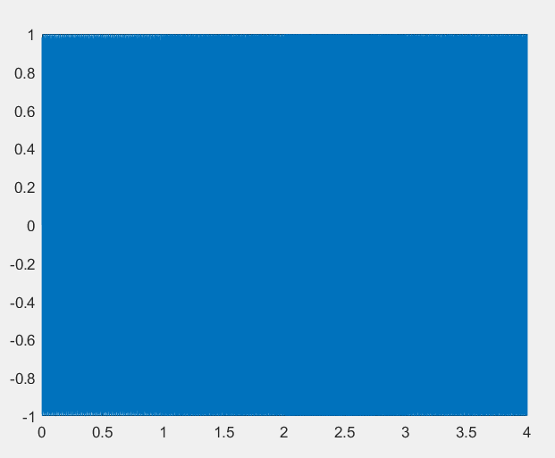
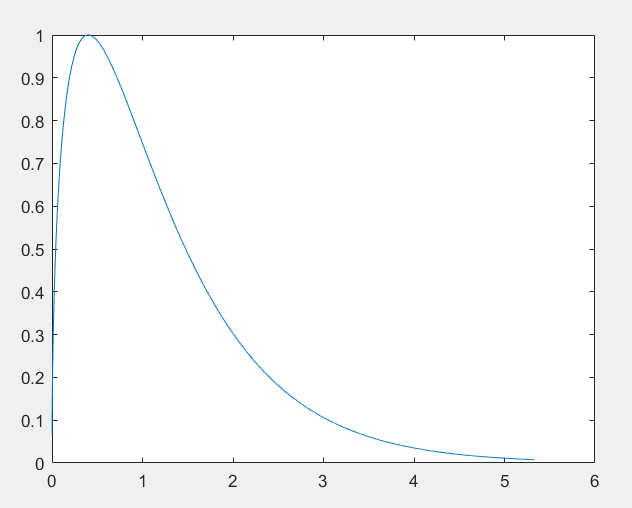
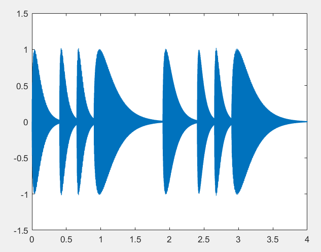
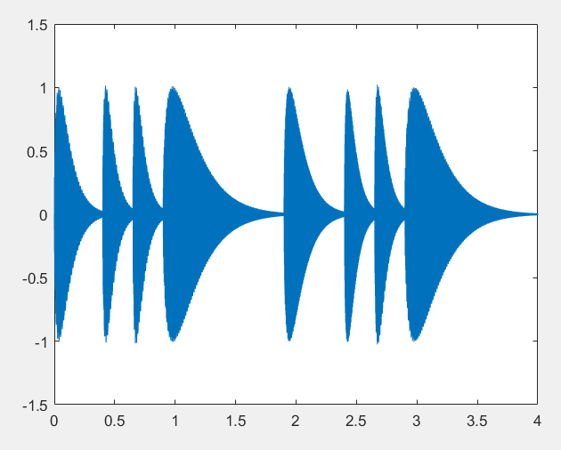
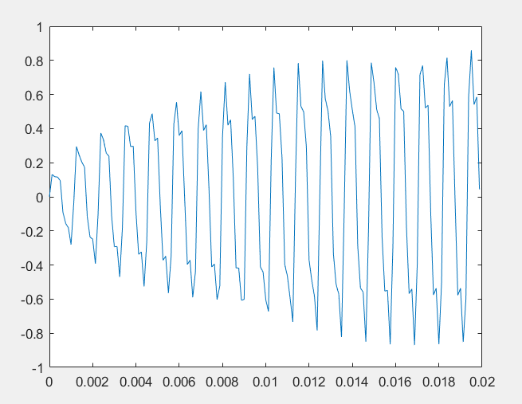
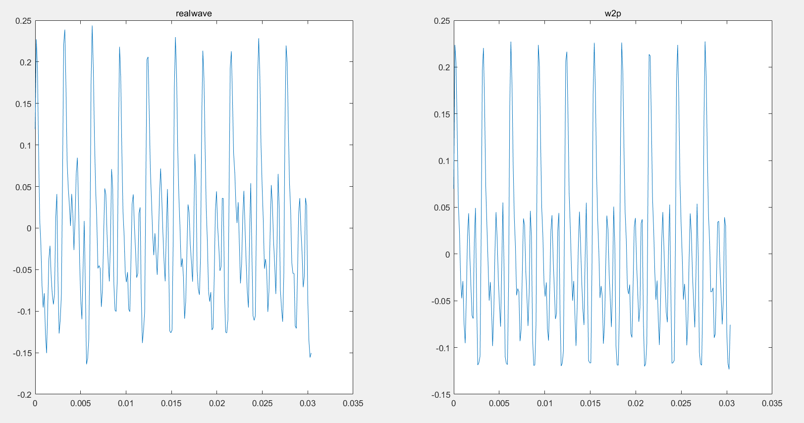
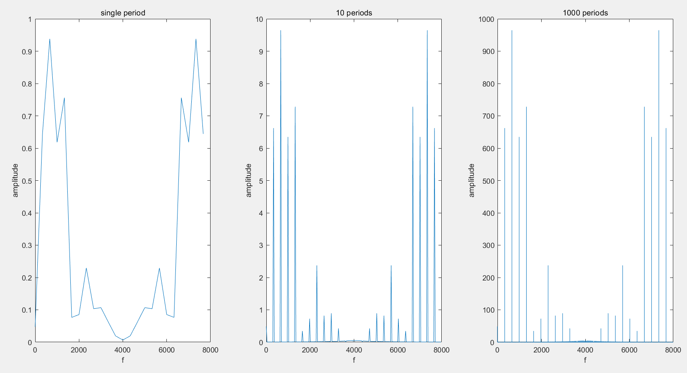
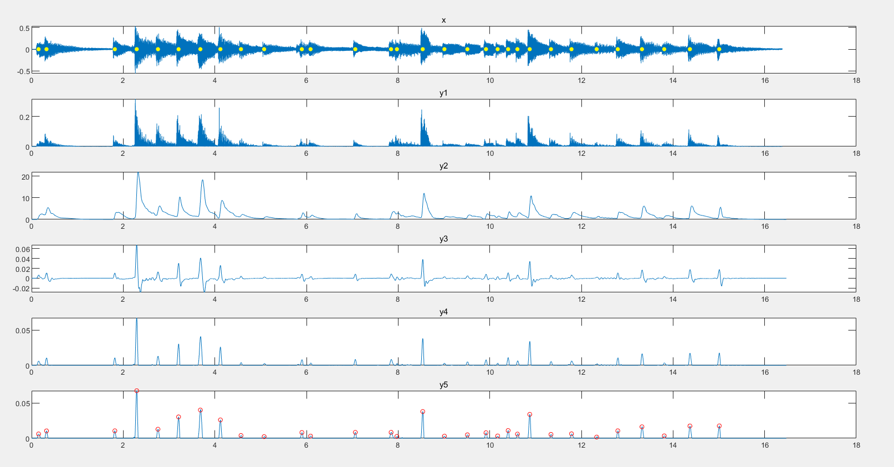

# Matlab音乐合成实验报告

---

无03 唐昌礼 2020010694

---

## 一、实验目的

1. 了解音乐基础知识，使用matlab编程合成音乐。
2. 增进对傅里叶级数、傅里叶变换的理解。
3. 熟悉matlab编程。

## 二、实验平台

我的所有代码均在 MATLAB R2020b 上编写，且全部能够正常运行。

## 三、实验内容

### 1.2.1 简单的合成音乐

#### 1 应用“十二平均律”合成《东方红》片段

首先，我先将可能用到的所有音调频率，制成表格，以便查询。具体的生成代码如下：

~~~matlab
base = [220, 440, 880]';
power = linspace(0, 1 - 1/12, 12);
rate = 2.^power;
tunes = base * rate;
~~~

上述代码中，最后的`tunes`变量，就是所有可能用到的频率矩阵。

接下来我对东方红片段进行编码，将每个音符转换成频率矩阵`tunes`中的元素，并为每个音符标注持续的节拍数。大致编码方式如下：

~~~matlab
song = [
    tunes(3, 1), 1;
    tunes(3, 1), 0.5;
    % ...
    % ...
]
~~~

接下来，根据`song`变量的编码结果与采样率，依次生成对应频率的正弦波，并将各个正弦波按次序合并，生成曲调。最后利用`sound`函数播放合成的音乐。

我将生成的音乐通过`plot`函数画出来。由于没有任何幅度上的调整，所以音乐信号的幅度始终保持为1，`plot`出来的结果就是多个矩形的合并。

该题代码位于`hw1_2_1_1.m`中。

#### 2 为音乐添加包络

大作业指导书中，指出了包络的时间特征：冲激、衰减、持续、消失。原图中是分段折线函数。在我的试验中，我发现如果包络曲线不够平滑，如分段函数那样有折线的点，那合成的乐曲听上去就不够悦耳。因此，我使用了以下形式的函数：
$$
f(x)=bx^ce^{-ax}
$$
该形式的函数曲线有着如图所示的趋势：

能够比较好的契合包络的实际特征。

在与同学探讨并仔细调参后，我将包络函数定为如下表达式：
$$
f(x)=4x^{0.5}e^{-x}
$$
接下来，我用包络函数去乘原本的乐音，并在相邻乐音间进行一定的重叠。重叠的具体做法是：首先指定要重叠的时间长度，根据采样率计算出要重叠的采样点的个数，然后在重叠处将前后两个信号相加。

使用包络并将信号部分重叠的代码如下所示：

~~~matlab
shiftTime = beat / 5;
shiftLen = shiftTime * fs;
t = linspace(-shiftTime, time , time * fs + shiftLen)';
sub_melody = sin(2 * pi * song(i, 1) .* t);
scale = Envelope(sub_melody);
sub_melody = sub_melody .* scale';
if max(sub_melody) ~= 0
	sub_melody = sub_melody / max(sub_melody);
end
melLen = length(melody);
subLen = length(sub_melody);
melody = [
    melody(1:melLen - shiftLen); 
    melody(melLen - shiftLen + 1: melLen) + sub_melody(1: shiftLen);
    sub_melody(shiftLen + 1: subLen) 
];
~~~

得到乐曲的波形如下

听上去也十分悦耳。

包络函数位于`Envelope.m`中，该题代码位于`hw1_2_1_2.m`中。

#### 3 将音乐分别升高八度、降低八度、升高半个音阶

代码与第2题基本一样。

升高八度与降低八度时，只需在使用`sound`函数时，改变采样率即可。代码如下

~~~matlab
% High
sound(melody, fs * 2);

% Low
sound(melody, fs / 2);
~~~

升高半个音阶，只需对原音乐波形进行`resample`，将原本采样率`fs`换为`fs*2^(1/12)`，再以`fs`为采样率播放音乐，这样就相当于所有频率均升高了`2^(1/12)`倍，即半个音阶。代码如下

~~~matlab
RHF = resample(melody, fs, round(fs * 2^(1/12)));
sound(RHF, fs);
~~~

该题代码位于`hw1_2_1_3.m`中。

#### 4 增加谐波

在每个音调的波形中（假设基波幅度为1），加入幅度为0.2的二次谐波，幅度为0.3的三次谐波。在代码中体现为

~~~matlab
sub_melody = sin(2 * pi * song(i, 1) .* t) + 0.2 * sin(2 * pi * song(i, 1) .* t * 2) + 0.3 * sin(2 * pi * song(i, 1) .* t * 3);
~~~

使用`sound`函数播放，发现旋律更加”厚重“了，音色也更加优美。

查看波形图

波形与`hw1_2_1_2`的类似，为了看出具体的区别，我将波形放大200倍查看，如下图所示

波形中多了一些谐波，谐波为音乐带来了不同的音色。

该题代码位于`hw1_2_1_4.m`中。

#### 5 自选音乐合成

我选用歌曲《从别后》，将它的简谱译为我设置的音乐格式。

我的音乐都译码成我自定义的格式保存在`resource`目录下的各个`json`文件中。这里的格式与第1题稍有不同，具体为：

~~~json
{
    "song": [
        [3, 5, 0.5],
        // ...
    ]
}
~~~

`json`文件中包含一个键值对，键为`song`，值为一个二维数组。每维上有3个数，前两个代表原本的音符对应于频率矩阵的索引，最后一个数代表持续的节拍数。频率矩阵相比第一题，多了基频为110Hz的波段，用如下代码生成：

~~~matlab
base = [110, 220, 440, 880]';
power = linspace(0, 1 - 1/12, 12);
rate = 2.^power;
tunes = base * rate;
~~~

然后使用`JSONLab`工具包中的`loadjson`函数读取`json`文件即可读出音乐曲谱。

我将获取音乐旋律的操作封装为一个函数`get_melody`，保存在`get_melody.m`文件中，在本题中直接调用该函数获取音乐旋律，送到matlab中播放。

~~~matlab
melody = get_melody(tunes, tunes_harmonic, fs, song, beat);
sound(melody, fs);
~~~

其中`tunes_harmonic`为每个音调的基波与谐波幅度比，我这里只使用了二次谐波，其幅度为基波的0.2倍，用如下代码生成该矩阵

~~~matlab
tunes_size = size(tunes);
tunes_harmonic = zeros([tunes_size, 2]);
for i = 1: 1: tunes_size(1)
    for j = 1: 1: tunes_size(2)
        tunes_harmonic(i, j, :) = [1, 0.2];
    end
end
~~~

本题代码位于`hw1_2_1_5.m`文件中。

### 1.2.2 用傅里叶级数分析音乐

#### 6 7 预处理

我首先在`hw1_2_2_6.m`文件中，找到导入`Guitar.MAT`文件，然后将`realwave`和`wave2proc`的波形`plot`出来观察，发现`wave2proc`相比`realwave`，噪声更少，更加整齐。同时我统计出这段音频里有10个周期的波形。

在思考过后，我认为要将`realwave`转换成`wave2proc`，可以通过重复多次`realwave`再取平均的方法，降低非线性谐波与噪声的影响，从而达到预处理的目的。

在`hw1_2_2_7.m`中，我实现了这一降噪的方法。具体分析与执行步骤如下：

由于原波形有十个周期，我希望通过平均十个周期的波形，完成降噪的操作。注意到原本的采样点并不是10的倍数，没法直接进行平均，因此我首先进行重采样，提高10倍的采样率，强行让采样点为10的倍数。

~~~matlab
realwave_10 = resample(realwave, 10, 1);
~~~

此时我可以认为，`realwave_10`的每`length(realwave_10) / 10`个点，构成波形的一个周期。接下来就是对十个周期的波形取平均。代码如下

~~~matlab
len = length(realwave);
realwave_10 = resample(realwave, 10, 1);
period = zeros(len, 1);

for i = 1: 1: len
    for j = 0: 1: 9
        period(i) = period(i) + realwave_10(j * len + i);
    end
    period(i) = period(i) / 10;
end
~~~

此时就得到了一个周期内的良好的波形`period`。

接下来再还原成十个周期，并重采样为原来的243个点。

~~~matlab
period_10 = repmat(period, 10, 1);
w2p = resample(period_10, 1, 10);
~~~

然后可以看一看我这种方法处理后的结果：

结果与材料中给定`wave2proc`非常相似，处理结果上也成功完成了降噪。

#### 8 应用傅里叶变换

我首先使用7中用到的方法进行预处理，得到`wave2proc`的波形，然后在其上应用快速傅里叶变换`fft`。

我分别对上述波形的1个周期、10个周期、1000个周期进行快速傅里叶变换，得到的幅频曲线图如下：

由快速傅里叶变换的性质可以知道，结果是关于`N/2`共轭的，所以幅频曲线关于`N/2`对称。频谱图也验证了这一点。而且随着时域的增加，曲线越来越近似一个个冲激函数。

接下来我要提取出波形中包含的各频率，以及它们各自的幅度。由于一个周期的点数近似为`243/10`，即大约为24、25，因此`fft`中有效的谐波次数最大为12。

我使用1000个周期的频谱，提取出峰值及其对应频率，并以基频为单位1，计算出各频率幅度的比例。核心代码如下：

~~~matlab
rep = 10 * 100;
period_amp = zeros(round(L3 / rep) + 1, 1);
period_freidx = zeros(round(L3 / rep) + 1, 1);
interval = rep;
period_amp(1) = abs(y3(1));
period_freidx(1) = 0;
for i = 1: 1: length(period_amp) - 1
    [period_amp(i + 1), period_freidx(i + 1)] = max(abs(y3(round((i - 0.5) * interval): min(round((i + 0.5) * interval), end))));
    period_freidx(i + 1) = period_freidx(i + 1) + round(i - 0.5) * interval;
end
period_amp = period_amp / period_amp(2);
period_fre = fs * period_freidx / L3;
~~~

我首先通过图像，确定频谱中有25个峰值点，然后对着25个区间分别求最大值及其对应索引，从而得到谐波分量及其幅度。最后谐波幅度都除以基波幅度，得到各谐波的幅度比。

前12次谐波幅度比及其对应频率如下，其中`index=1`为基波：

| index | frequency | amplitude |
| ----- | --------- | --------- |
| 0     | 0.        | 0.07      |
| 1     | 329.55    | 1.00      |
| 2     | 658.77    | 1.46      |
| 3     | 987.98    | 0.96      |
| 4     | 1317.20   | 1.10      |
| 5     | 1646.42   | 0.05      |
| 6     | 1975.64   | 0.11      |
| 7     | 2304.86   | 0.36      |
| 8     | 2634.07   | 0.12      |
| 9     | 2963.29   | 0.14      |
| 10    | 3292.51   | 0.06      |
| 11    | 3753.42   | 0.01      |

基频约为329.55Hz，查表知，该频率音调为小字组的E。

本题代码位于`hw1_2_2_8.m`文件中。

#### 9 自动分析节拍与音调

我将自动分析音调与节拍的功能，封装在函数文件`analyse_tunes.m`中。在`hw1_2_2_9.m`文件中调用了该函数，完成了对音调与节拍的自动提取。接下来我将详细解释函数`analyse_tunes`的编写思路。

>注：
>
>这段程序的编写，参考了谷源涛老师2021年信号与系统大作业之"B站，我来了"。我从GitHub上下载了谷老师去年的大作业说明，并参考其“第2部分——节奏点提取” 的方法，进行节拍的划分。
>
>谷老师2021年大作业链接为：[Project-for-Signals-and-Systems-2021/Project2021.pdf at main · zhangzw16/Project-for-Signals-and-Systems-2021 (github.com)](https://github.com/zhangzw16/Project-for-Signals-and-Systems-2021/blob/main/Project2021.pdf)

##### 分析节拍

我参考谷老师2021年大作业节奏点提取的方法，将划分节拍分为五个步骤：平方、加窗、差分、半波整流、提取峰值。

加窗步骤处，我尝试了多个窗的选择，发现并没有显著的区别。我这里使用的是matlab提供的`barthannwin`。

前四步骤都较为简单，关键步骤在于第五步：提取峰值。我将该部分代码封装在函数文件`find_peak.m`中，该函数能较好地识别出序列中的峰值位置。

`find_peak`的具体想法是：峰值比两端的值都要大，因此做差分后，前一个数为负，后一个数为正。可以根据这个思路，提取峰值位置。

但是由于曲线可能会在连续位置有波动，如果仅仅使用这个方法，很容易在连续的多个位置都识别成峰值，而实际上我们只需要这一个就够了。因此，我在代码中规定：只要识别出了一个峰值，那么接下来长为`interval`的区间内，都不会识别出峰值。这个方法能够一定程度上缓解连续多个位置被识别成峰值的问题，但不能完全解决。因为，如果`interval`的值设的太小，仍会错误地连续识别出峰值；如果`interval`太大，可能会错过一些峰值的选取。

针对上一问题，我又做出如下改进：先用上面的方法初筛一遍峰值，保证`interval`的值不能太大，即不会漏掉峰值。然后再用上面的方法进行一波筛选，此时阈值使用一个新的`threshold_interval`。同时在第2遍筛选时，如果有在同一个`threshold_interval`区间内的两个备选峰值点，则选择取值更大的点作为峰值点，另一个被抛弃。

两遍筛选，相当于有两个维度的调整空间，这样一来，筛选的准确率就高了不少。

经过我的测试，上面两个超参中，`interval`的值影响不大，只要保证不漏掉峰值，且不要太小就行；`threshold_interval`的值在1/8采样率左右，能够获得比较好的结果。

两遍筛选的关键代码如下：

~~~matlab
dif = y(2: end) - y(1: end - 1);
idx = [];
i = 2;
if interval <= 0
	interval = 1;
end
while i <= length(dif)
	if dif(i) < 0 && dif(i - 1) >= 0
    	idx = [idx; i];
		i = i + interval; 
	else
		i = i + 1;
	end
end

choose_idx = zeros(length(idx), 1) ~= 0;
choose_idx(1) = 1;
i = 2;
while i <= length(idx)  
	if abs(idx(i) - idx(i - 1)) >= threshold_interval
		choose_idx(i) = true;
	else 
		if y(idx(i)) > y(idx(i - 1))      % Choose the ones with higher amplitude first
            choose_idx(i) = true;
            choose_idx(i - 1) = false;
		else
			choose_idx(i) = false;
			choose_idx(i - 1) = true;
		end
	end
	i = i + 1;
end
peak_idx = idx(choose_idx);
~~~

经过上述思路，我将`fmt.wav`的节奏点划分如下图所示

`x`是原来波形，黄色圆圈是划分的节奏点。可以看到，经过上述方法划分的节奏点还是非常精确的。

##### 分析音调

划分好节拍后，就可以对原本音乐的各个片段进行音调分析了。具体代码封装在`analyse_tunes.m`中

我的思路是，先准备一个频率矩阵`tunes`，里面存储了音调对应的频率；与此同时准备一个存储相应谐波幅度的矩阵`tunes_harmonic`。

然后对片段做`fft`，识别出其基频，找到频率矩阵`tunes`中与该基频最近的音调，将该音调确定为这个音乐片段的音调，然后在谐波矩阵`tunes_harmonic`对应音调处记录该片段谐波分量。

对所有片段均做上述操作。最后将谐波矩阵`tune_harmonic`的基波幅度归一化，得到各音调的各个谐波之间的幅度比例（以基波幅度为单位1）。

或许对所有片段识别完后，可能还有些音调没有涉及到，此时对寻找距离这些音调最近的、已被识别出来过的音调的谐波幅度比，作为未曾被识别出的音调的谐波幅度比。

在初步尝试后，结果并不算太好。我又在细节上做出了一些改进。

##### 分析音调的改进

在`fft`阶段，我对片段加高斯窗`gausswin`，让片段两端衰减，避免相邻音符的干扰，再将加窗后的片段重复100次后，再进行`fft`，减少了噪音的影响。然后使用`find_peak`函数提取出基频以及谐波分量。

这样做之后提取基频仍然不够准确。我又再次做出了调整。

我在上述操作的基础上，又提取了`fft`的最大值及其对应频率。由于`fft`的最大值必然是峰值，其对应频率必然是基频的整数倍，因此可以从这里入手去寻找基频。

我使用暴力搜索法，在`find_peak`中已预选出的基频及谐波中，从最大值对应频率的`1/N`到最大值对应频率进行遍历搜索，看遍历的值是否已经在预选值中出现。如果出现，就停止搜索，并将该值定为基频。由于一般来说，最大值对应频率不会偏离基频很远，因此我遍历的参数`N`设为`N=15`。其实`15`已经比较大了，这种遍历方法基本能准确定位基频，因为在实际运行中我发现，大部分情况基频都是最大值对应频率的`1/3, 1/2, 1`倍，并不会偏离基频太远。

在暴力搜索时，我先初步筛掉`fft`幅度小于最大值`1/10`倍的预选值，然后在每个预选值`2*max_error_idx` 的区间内展开搜索，如果在该范围内存在最大值对应频率的`1/j`倍的点，则将其取出作为基频点。

暴力搜索的核心代码如下：

~~~matlab
least_peak = 10;
peaksidx = peaksidx(find(pre_peaks >= max_abs / least_peak));

max_search_times = 15;
max_error_fre = 10;
N = length(clip);
max_error_idx = max_error_fre * N / fs; 
min_fre = base(1);
min_fre_idx = min_fre * N / fs;
choose_base_idx = [];
times = 1;
for j = max_search_times: -1: 1
	temp_idx = round(max_idx / j);
    if temp_idx < min_fre_idx - max_error_idx && j ~= 1
    	continue
    end
    temp_choose = peaksidx(peaksidx >= temp_idx - max_error_idx & peaksidx <= temp_idx + max_error_idx);
    if length(temp_choose) ~= 0
        choose_base_idx = temp_choose;
        times = j;
        break
    end
end
[~, base_fre_num] = max(abs_fft_amp(choose_base_idx));
base_fre_idx = choose_base_idx(base_fre_num);
base_fre_amp = abs_fft_amp(base_fre_idx);
~~~

引入了暴力搜索法之后，结果有了很大的改善，但是乐曲听上去仍有瑕疵，我又在此基础上做了进一步改进。

我先作出如下假设：基频的`fft`幅度不会太小，我假设其幅度不会小于邻近谐波分量幅度的`1/base_crierion`倍。

根据这个假设，我对暴力搜索出的基频进行判断，看该频率幅度是否超过邻近谐波分量幅度的`1/base_crierion`倍。若未超过，则将该基频替换为相应的频率。具体代码如下：

~~~matlab
% first judge whether the base frequency is correct. 
% base_criterion is the limited threshold
base_criterion = 2;
for k = 2: 1: 5
	[k_amp, kidx] = max(abs_fft_amp(round((base_fre_idx - max_error_idx) * k): round((base_fre_idx + max_error_idx) * k)));
    if k_amp / base_fre_amp >= base_criterion
        base_fre_idx = kidx;
        base_fre_amp = k_amp;
        break
    end
end
~~~

通过之后合成的音色来看，经过重重改进，基频分析的效果变得非常好了。

提取出基频后，就是保存对应音调的谐波矩阵了。这一部分较为简单，具体代码如下：

~~~matlab
temp_delta = tunes - base_fre_idx / length(clip) * fs;
[~, temp_tunesidx] = min(abs(temp_delta(:)));
[xidx,yidx] = ind2sub(tunes_size, temp_tunesidx);   

tunes_harmonic(xidx, yidx, 1) = tunes_harmonic(xidx, yidx, 1) + 1;
for k = 2: 1: maximum_harmonic
	if (base_fre_idx - max_error_idx) * k > 0
    	k_amp = max(abs_fft_amp(round((base_fre_idx - max_error_idx) * k): round((base_fre_idx + max_error_idx) * k)));
    else
    	k_amp = max(abs_fft_amp(1: round((base_fre_idx + max_error_idx) * k)));
    end
    tunes_harmonic(xidx, yidx, k) = tunes_harmonic(xidx, yidx, k) + k_amp / base_fre_amp;
end
~~~

至此，对于一个片段的音调分析就完成了！
